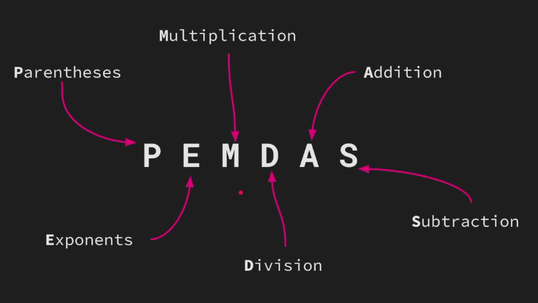

# Operator Precedence

| Precedence | Operator          | Evaluated     |
| ---------- | ----------------- | ------------- |
| 6          | ++ --             | left -> right |
| 5          | \* / % << >> & &^ | left -> right |
| 4          | + - \| ^          | left -> right |
| 3          | == != < <= > >=   | left -> right |
| 2          | &&                | left -> right |
| 1          | \|\|              | left -> right |

**NOTE**: 6 has highest precedence and 1 has lowest
