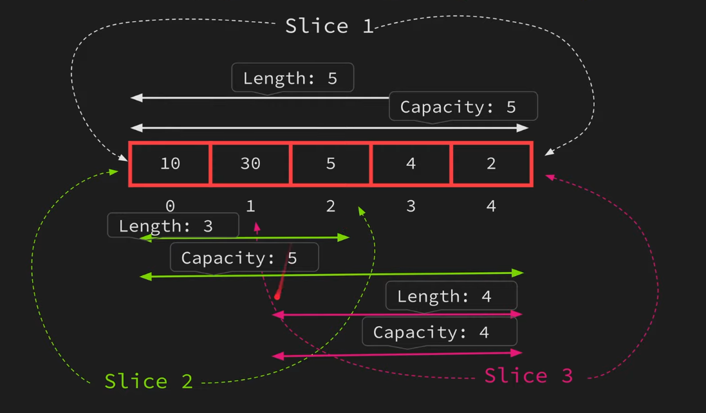

# Slicing

- Go allows you to slice a slice or array to create a new slice.
- Range of indices are used to slice a slice or array.
- Eg: `b := a[1:10]`
- The range specified is a half-open range which includes the first element but excludes the last one.

## Examples

|     | Examples      | Actual Values Sliced      |
| --- | ------------- | ------------------------- |
| 1.  | `b := a[2:5]` | index 2 to index 4        |
| 2.  | `b := a[:5]`  | index 0 to index 4        |
| 3.  | `b := a[3:]`  | index 3 to last index     |
| 4.  | `b := a[:]`   | first index to last index |

## Precaution with Slicing

- New slice still refers to the same underlying array the original slice uses.
- Manipulating or appending values in the child slice can cause a ripple effect.
- Be careful when slicing a slice or array to create a new slice when you want to manipulate the child slice.

## Sharing Underlying Array

## Passing Capacity

- The slice expression accepts a third value which is the capacity of the new slice.
- Passing capacity equal to length will make sure a new underlying array is created when you append.
- Eg: `b := a[:10:10]`
- Manipulating the slice directly would lead to the same problem.

## The `copy` Function

- `copy(dst, src []Type)`
- Copy function take the destination slice and the source slice, returning the number of elements copied.
- It will copy as many elements it can.
- First create an empty slice of given length and copy of the values.

## Example

| Example            | Description                        |
| ------------------ | ---------------------------------- |
| `copy(a, b)`       | copy elements from slice b to a    |
| `copy(a, b[1:10])` | copy range of elements from b to a |
| `copy(a, b[:])`    | copy elements from array b to a    |
