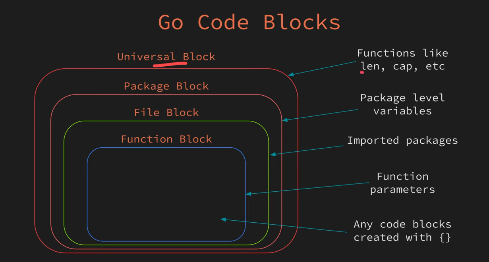

# Code Blocks

- In Go, variables can be created at different levels within a program's structure.
- These levels are known as code blocks, or simply, blocks.
- Variables defined in an outer block are accessible within inner blocks, but the reverse is not true.
- To establish a code block within a function, you use curly braces {}.

## Example

```go
// package level variable.
var a = 10
func main() {
  // function level variable.
  b := 20

  {
    // block variable.
    c := 30
    // a, b & c can be accessed here.
  }
  // a & b can be accessed here
  // but c cannot be accessed here
}

```



## Shadowing

- Shadowing occurs when you create a variable with the same name in an inner code block as in an outer code block.
- Inner variable takes precedence over the outer variable.
- Shadowing should be avoided for code clarity.
- Tools can help detect and fix shadowing.

## Example

```go
package main

import "fmt"

func main() {
  x := 20

  if true {
    x := 10 // This will shadow the outer 'x'.
    fmt.Println(x) // This will print 10 not 20
  }

  fmt.Println(x) // This will print 20, the outer 'x'.
}
```